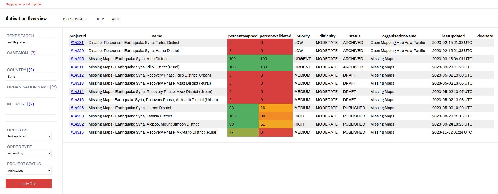

# HOTOSM Collate

HOTOSM Collate (this application) is primarily intended to help HOTOSM activation managers to keep track of the progress of Tasking Manager mapping projects during an activation by gathering their status information if a table format. It also has uses for project gardening: finding old inactive or completed projects that are still hanging around without having been archived.

For example, at the time of writing, a table of all Tasking Manager project mentioning "earthquake" that are located in Syria looks like this: 

The overview tool is a seperate piece of software to the HOTOSM Tasking Manager, however it uses the same project data as main Tasking Manager instance tasks.hotosm.org. The data is pulled in in real-time from the Tasking manager API. Therefore if you project is on tasks.hotosm.org, it will also show up in this tool. 

If you have any questions or requests about this tool, please feel free to contact me at @jarmokivekas on the HOTOSM slack workspace.

This project is free open source software. The source code is hosted at https://github.com/jarmokivekas/hotosm-activation-gis-resources/

# State of the software

There is a github issue tracking the implementation of this to the tasking manager https://github.com/hotosm/tasking-manager/issues/3394

# Change requests & Bug reports

You can send me a message on the hotosm slack @jarmokivekas or even create and issue in the [github repository](https://github.com/jarmokivekas/hotosm-activation-gis-resources/issues)

The intended use of this tool is to help HOTOSM activation managers to keep track of progress in ongoing projects in an activation.

